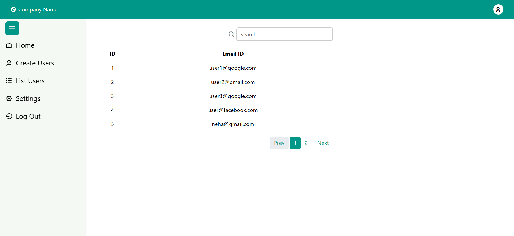
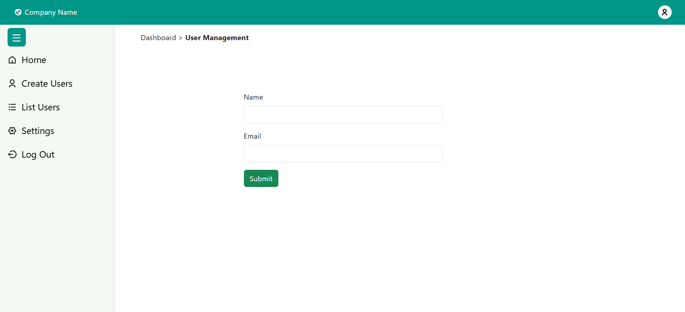
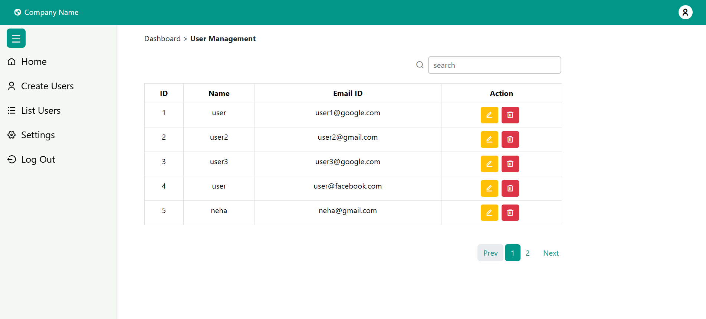
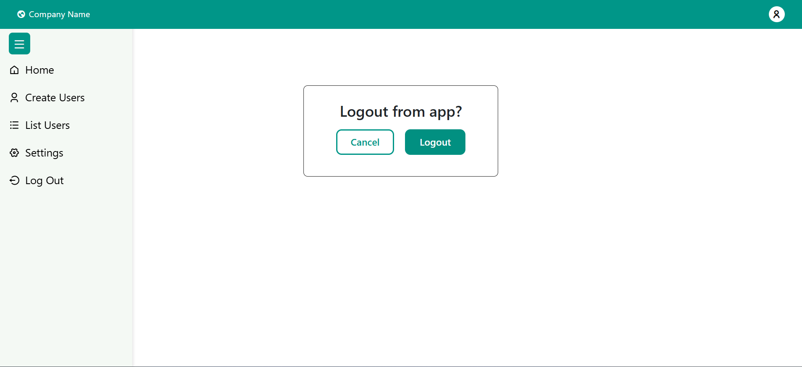
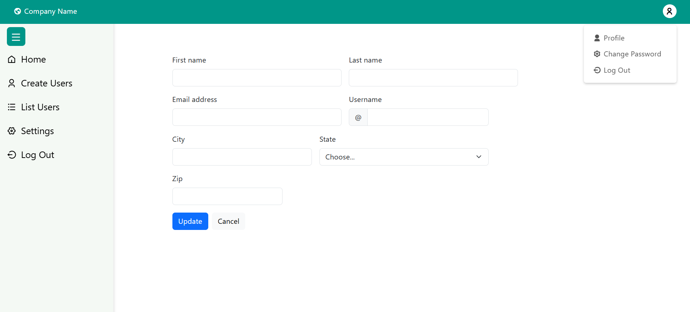
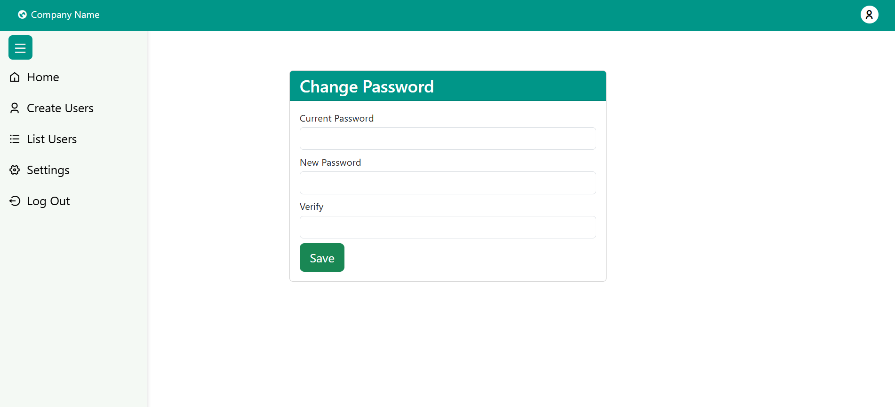

<h3>🚀 React CRUD App (User Management) </h3>

This is a simple CRUD (Create, Read, Update, Delete) application built using React. It allows users to manage user data with operations like adding, editing, and deleting users. The app interacts with a mock API to simulate real-world API calls.

---

<h3>📌 Features</h3>

✅ Fetch users from a mock API

✅ Add new users

✅ Edit user details

✅ Delete users

✅ Responsive design

✅ Toast notifications for actions

---

<h3>🛠️ Technologies Used</h3>   

<ul>
<li>React (Frontend framework)</li>
<li>React Router (Navigation)</li>
<li>Axios / Fetch API (API calls)</li>
<li>Bootstrap (Styling)</li>
<li>Mock API (Simulating backend)</li>
</ul>

---

<h3>🔗 API Endpoints (Mock API)</h3>
 
<ul>
<li>GET  → Fetch all users</li>
<li>POST  → Add a new user</li>
<li>PUT  → Update user details</li>
<li>DELETE  → Remove a user</li>
</ul>

---
<h3>📷 Screenshots</h3>

---

<h3>🛠️ Future Enhancements</h3>

✅ Implement authentication

✅ Improve UI/UX with animations

---

<h3>📝 License</h3>
This project is open-source and free to use.

👩‍💻 Developed by Neha Kashyap